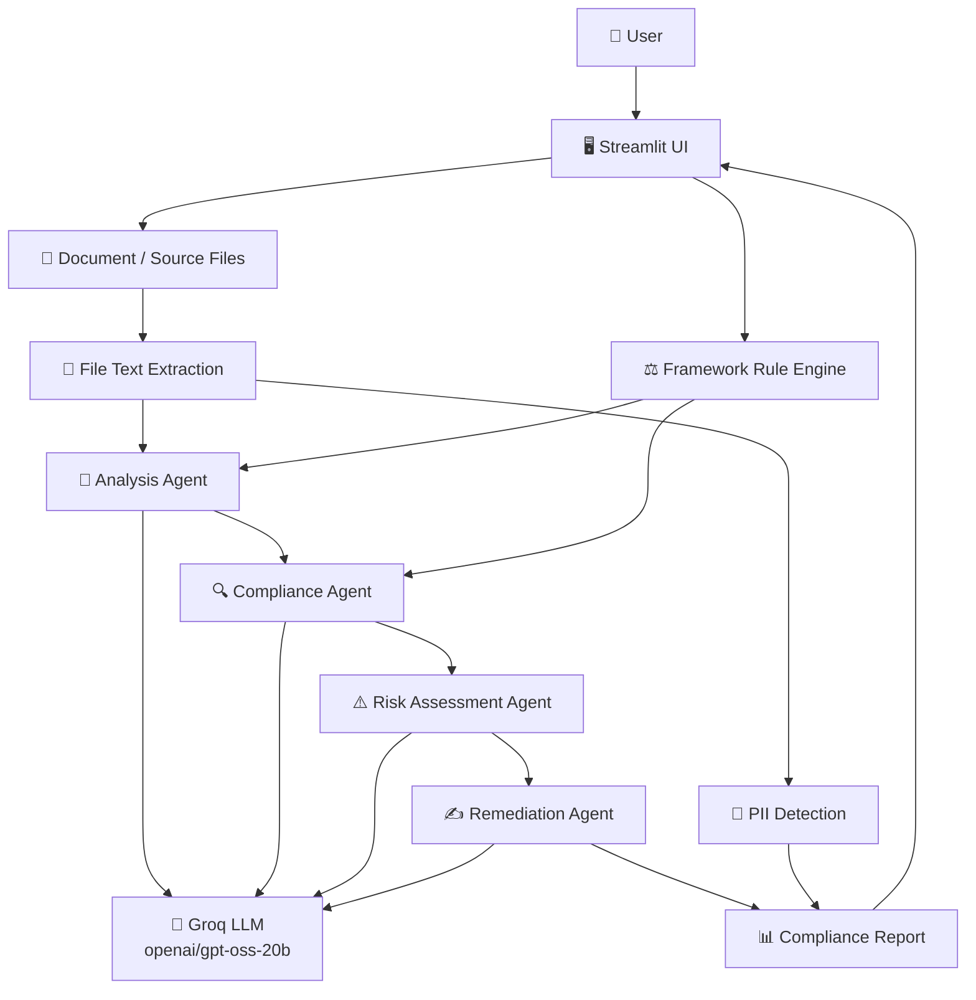

# 🛡️ AI Compliance Policy Checker

### Agentic AI System for Automated Compliance Analysis

> An AI-powered compliance agent that analyzes contracts, policy documents, and source code against regulatory frameworks, identifies compliance gaps, assesses risks, and generates remediation guidance.


---

## 📖 Overview

The **AI Compliance Policy Checker** is an agentic AI system designed to automate the initial review of organizational documents and source code against compliance requirements.

The system can analyze uploaded **PDF, TXT, Python, JavaScript, and Java files**, evaluate them against selected compliance frameworks, identify potential risks, and provide practical remediation guidance.

Supported frameworks:

- GDPR
- HIPAA
- ISO 27001
- CCPA

The project was developed as a prototype for the **Automated Compliance & Policy Checker Agent** problem statement.

---

## 🎯 Problem Statement

Organizations often need to review contracts, internal policies, privacy documents, and software practices against regulatory and security requirements.

Manual compliance review can be time-consuming and difficult to scale.

This project provides an AI-powered policy engine that:

- Reads organizational documents and source files
- Cross-references them against predefined compliance requirements
- Identifies compliance gaps
- Assigns risk severity
- Provides evidence from the uploaded content
- Suggests remediation actions
- Generates compliant alternative wording

---

## ✨ Key Features

| Feature | Description |
|---|---|
| 📄 Multi-file Analysis | Analyze multiple documents and source files together |
| ⚖️ Framework Selection | GDPR, HIPAA, ISO 27001 and CCPA |
| 🔍 Compliance Analysis | Evaluates each requirement against the uploaded content |
| 🚦 Risk Assessment | Classifies findings as Low, Medium or High severity |
| 📌 Evidence Detection | Uses relevant text from the uploaded content |
| ✍️ Remediation Guidance | Suggests actions to address compliance gaps |
| 📝 Compliant Alternatives | Generates replacement policy/contract wording |
| 🔐 PII Detection | Detects obvious email, phone and URL patterns |
| 📊 Compliance Score | Calculates an overall compliance score |
| 📥 Report Generation | Download the complete analysis as a text report |

---

# 🏗️ Project Architecture



---

# 🔄 Agentic Workflow

The system uses a sequential multi-stage agent workflow where each stage performs a specific responsibility.

```text
User uploads files
        ↓
File Text Extraction
        ↓
Framework Selection
        ↓
┌──────────────────────────┐
│     Analysis Agent       │
│ Identify relevant text   │
│ for each requirement     │
└────────────┬─────────────┘
             ↓
┌──────────────────────────┐
│    Compliance Agent      │
│ Evaluate every rule      │
│ Compliant / Partial /    │
│ Violation                │
└────────────┬─────────────┘
             ↓
┌──────────────────────────┐
│     Risk Agent           │
│ Assign Low / Medium /    │
│ High severity            │
└────────────┬─────────────┘
             ↓
┌──────────────────────────┐
│   Remediation Agent      │
│ Recommendations +        │
│ compliant alternatives   │
└────────────┬─────────────┘
             ↓
      PII Detection
             ↓
      Compliance Report
```

### Agent Responsibilities

**1. Analysis Agent**

- Reads the extracted document content
- Receives the selected framework rules
- Identifies relevant evidence for each requirement
- Does not invent document evidence

**2. Compliance Agent**

- Evaluates every framework requirement
- Classifies findings as:
  - Compliant
  - Partial
  - Violation
- Explains the identified compliance status

**3. Risk Assessment Agent**

- Reviews the compliance findings
- Assigns severity:
  - Low
  - Medium
  - High
- Connects severity with the identified compliance status

**4. Remediation Agent**

- Generates practical recommendations
- Provides suggested compliant alternative wording
- Produces guidance that can be used to improve the document

---

# 🧠 Why This Is an Agentic System

Unlike a simple chatbot that only generates an answer, the system performs a structured workflow.

```text
Understand Input
      ↓
Select Applicable Rules
      ↓
Analyze Evidence
      ↓
Evaluate Compliance
      ↓
Assess Risk
      ↓
Generate Remediation
      ↓
Produce Final Report
```

Each stage has a defined responsibility and passes its output to the next stage.

The selected compliance framework also dynamically changes the rule set used during analysis.

---

# ⚙️ Supported Frameworks

### GDPR

Prototype rules covering areas such as:

- Purpose of data collection
- User consent
- Data retention
- User rights
- Data sharing
- Data security
- Privacy contact

### HIPAA

Prototype rules covering:

- Protected Health Information
- Access controls
- Data security
- Information disclosure
- Patient rights
- Incident response
- Privacy contact

### ISO 27001

Prototype rules covering:

- Information security policy
- Risk management
- Access control
- Incident management
- Business continuity
- Asset management
- Security monitoring

### CCPA

Prototype rules covering:

- Personal information collection
- Purpose of collection
- Consumer access rights
- Deletion rights
- Data sharing
- Opt-out rights
- Privacy contact

---

# 🛠️ Technology Stack

| Layer | Technology |
|---|---|
| Language | Python |
| UI | Streamlit |
| LLM | Groq — `openai/gpt-oss-20b` |
| AI Client | OpenAI-compatible Python SDK |
| PDF Processing | PyPDF |
| Environment Management | python-dotenv |
| Rule Engine | Python-based framework rules |

---

# 📂 Project Structure

```text
compliance-agent/
│
├── app.py              # Streamlit application and UI
├── agent.py            # AI agent workflow
├── rules.py            # Compliance framework rules
├── README.md           # Project documentation
├── .gitignore          # Git ignore configuration
├── .env                # API key configuration
└── venv/               # Python virtual environment
```

---

# 🚀 Getting Started

## 1. Clone the Repository

```bash
git clone https://github.com/Hritika-07/compliance-agent.git
cd compliance-agent
```

## 2. Create Virtual Environment

### Windows

```bash
python -m venv venv
venv\Scripts\activate
```

## 3. Install Dependencies

```bash
pip install streamlit pypdf python-dotenv openai
```

## 4. Configure API Key

Create a `.env` file:

```env
GROQ_API_KEY=your_groq_api_key
```

Never upload `.env` to GitHub.

## 5. Run the Application

```bash
streamlit run app.py
```

The application will open in the browser at:

```text
http://localhost:8501
```

---

# 💡 Example Workflow

```text
Upload:
privacy_policy.pdf
security_policy.pdf
application.py

        ↓

Select:
GDPR

        ↓

AI Compliance Analysis

        ↓

Results:

Compliance Score
High Risk Findings
Medium Risk Findings
Compliant Requirements
PII Exposure

        ↓

Detailed Findings

Evidence
Issue
Severity
Recommendation
Compliant Alternative

        ↓

Download Compliance Report
```

---

# 🔐 Safety & Accuracy

- The system uses evidence from the uploaded content for compliance analysis.
- AI agents are instructed not to invent document evidence.
- Compliance rules are explicitly supplied to the agents.
- API credentials are stored through environment variables.
- PII detection is based on identifiable text patterns.
- Generated recommendations are guidance and should be reviewed by qualified professionals.

> **Note:** This is a hackathon prototype and does not provide legal certification or guarantee regulatory compliance.

---

# ⚠️ Current Limitations

- Framework rules are simplified prototype rules.
- Source code is analyzed as uploaded text rather than executed.
- PII detection currently focuses on obvious pattern-based identifiers.
- Regulatory requirements are not automatically synchronized with changing regulations.
- GitHub repository crawling is not currently implemented.

---

# 🔮 Future Enhancements

- 🔗 Direct GitHub repository scanning
- 📚 Larger regulatory rule libraries
- 🔄 Automatic regulatory rule updates
- 📑 Advanced document citations
- 🗂️ Persistent compliance audit logs
- 📊 Advanced compliance dashboards
- 🔐 More advanced PII and sensitive-data detection
- 🌐 Additional compliance frameworks

---

# 🏆 Hackathon Context

**Problem Statement:** Automated Compliance & Policy Checker Agent

The project demonstrates:

- Agentic AI workflow
- Multi-stage AI reasoning
- Compliance rule evaluation
- Risk assessment
- Automated remediation
- PII exposure detection
- Document and source-code analysis
- Interactive compliance reporting

---

# 👨‍💻 Developer

**Hritika Choudhary**

B.Tech CSE Student

---

<div align="center">

### 🛡️ Built with Python, Streamlit & Agentic AI

**Automating compliance analysis, one document at a time.**

</div>
